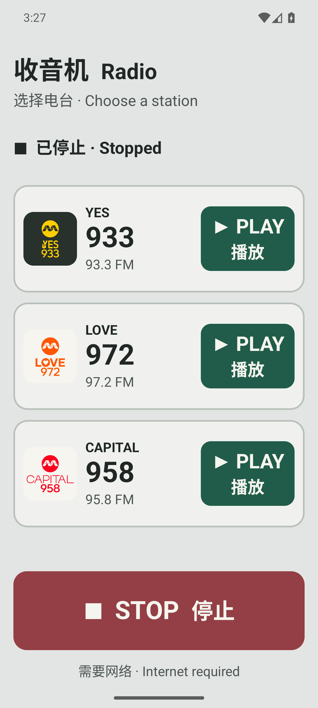

# Singapore Radio

A simple Android radio player built for older listeners and everyday family use. It plays **YES 933**, **LOVE 972**, and **CAPITAL 958**, with large controls and English/Chinese labels.

The app adds no ads, analytics, subscriptions, or sign-in. **Live radio needs an internet connection**; this is not an offline radio receiver. Advertisements within a station's broadcast may still be heard.



## Features

- Three easy-to-read station rows with logos beside station names.
- Light grey background, large green PLAY buttons, and a large red STOP button.
- English and Chinese labels, with scrolling for smaller screens or larger text settings.
- Playback with the screen off, audio focus handling, and stopping when headphones disconnect.
- Clear connection, offline, and playback status messages.
- Direct broadcaster streams; no project-owned audio server.

## Build

Requires **JDK 17**, **Android SDK Platform 35**, and Android SDK Build Tools. The included Gradle wrapper uses Gradle 8.9.

1. Clone this repository and open it in Android Studio, or install the requirements for a command-line build.
2. Set `JAVA_HOME` to JDK 17 and `ANDROID_HOME` to your Android SDK directory. Alternatively, configure `sdk.dir` in an untracked `local.properties` file.
3. Build a debug APK:

```powershell
# Windows
.\gradlew.bat :app:assembleDebug
```

```sh
# macOS / Linux
./gradlew :app:assembleDebug
```

The debug APK is written to `app/build/outputs/apk/debug/app-debug.apk`. It uses a development signing key and cannot update a differently signed installation.

For a release build and Android lint checks:

```sh
./gradlew :app:assembleRelease :app:lintRelease
```

On Windows, use `.\gradlew.bat` instead of `./gradlew`. The release APK in `app/build/outputs/apk/release/` is **unsigned**. Sign it with your own private key before installing or distributing it. An update must use the same application ID and signing key as the existing installation. Signing keys and passwords are deliberately excluded from this repository.

## Project details

- Current version: **1.2** (version code 3)
- Android 7.0 (API 24) or newer
- Package: `com.oai.singaporeradio`
- Native Java Android UI
- AndroidX Media3 ExoPlayer 1.8.0 and AndroidX Core 1.15.0
- `MainActivity.java`: station list, large controls, and playback status
- `RadioService.java`: streaming, background playback, audio focus, and connection handling
- `StationData.java`: the three station names and stream endpoints

Version 1.2 adds the accessible interface and app icon. The playback service, station data, and station model are unchanged from the working version 1.1. This repository preparation makes no app-code changes.

Stream addresses and availability are controlled by the broadcasters. If an endpoint changes, update `StationData.java` and rebuild.

## Station attribution

This is an independent community project and is not an official Mediacorp or meLISTEN app. Station names, logos, and broadcasts belong to their respective owners. See [THIRD_PARTY_NOTICES.md](THIRD_PARTY_NOTICES.md) for asset sources and dependency information. Publishing this source does not grant rights to third-party branding or broadcasts; permission for broader distribution has not been verified.
