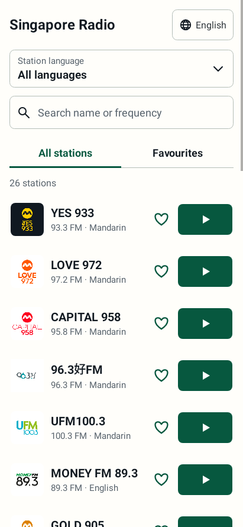
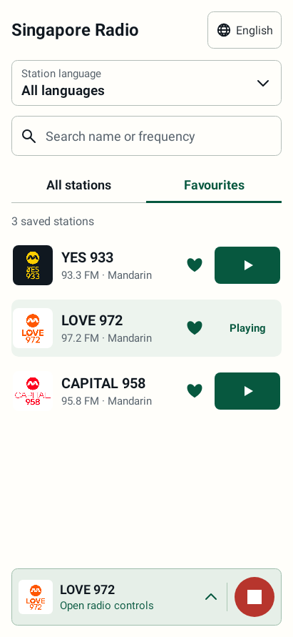
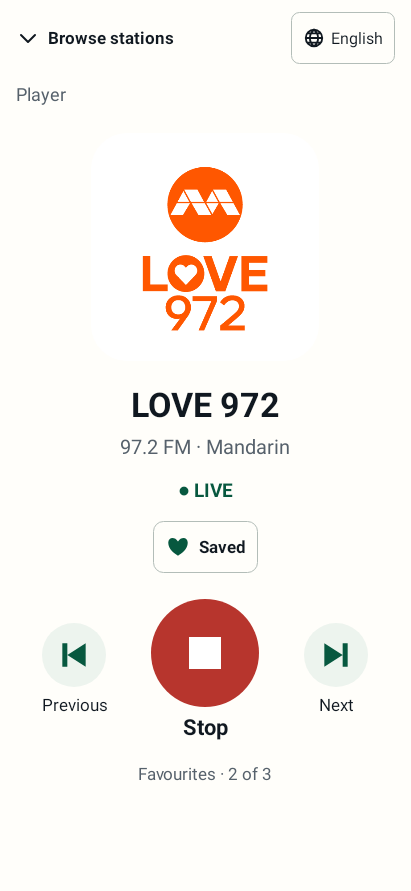

# Singapore Radio

A simple Android radio player built for older listeners and everyday family use. It offers **26 Singapore radio stations and digital channels**, with large controls and a choice of **English, Chinese, Malay or Tamil** for the app interface. **YES 933**, **LOVE 972**, and **CAPITAL 958** remain first for existing listeners. See the [station catalog and source checks](docs/STATIONS.md) for coverage and availability.

The app adds no ads, analytics, subscriptions, or sign-in. **Live radio needs an internet connection**; this is not an offline radio receiver. Advertisements within a station's broadcast may still be heard.





## Features

- A shared catalog covering Mediacorp, SPH Media, BBC World Service and Kakee.
- Language filters for Mandarin, English, Malay, Tamil, Cantonese and Korean; bilingual stations appear in both relevant filters.
- Full station names, FM/online labels and language information. Official station and channel logos for all 26 entries are bundled in the app and appear without extra network requests.
- Warm ivory and forest-green interface, with All stations as the default tab and a separate Favourites tab.
- Search by station name or frequency, combined with the station-language filter.
- Separate heart buttons save favourites locally without changing playback.
- A native-name app-language picker: English, 中文, Bahasa Melayu and தமிழ். App language and station language are independent.
- Tapping a station's Play button opens the Focus Player. Browse stations returns to the existing list while audio continues.
- An inset translucent bottom bar opens the player and provides an icon-only green Start / red Stop shortcut. It remains available after stopping.
- Previous and Next use the station list captured when listening started.
- Wrapping station names, adaptive layouts and scrolling support smaller screens and larger system text.
- Filters, search, tab and player state survive screen rotation; favourites and the last selected station persist across launches.
- Playback with the screen off, audio focus handling, and stopping when headphones disconnect.
- Clear connection, offline, and playback status messages.
- Direct broadcaster streams; no project-owned audio server.

## Build

Requires **JDK 17 or 21**, **Android SDK Platform 36**, and Android SDK Build Tools. The included Gradle wrapper uses Gradle 8.11.1 and Android Gradle Plugin 8.10.1.

1. Clone this repository and open it in Android Studio, or install the requirements for a command-line build.
2. Set `JAVA_HOME` to JDK 17 or 21 and `ANDROID_HOME` to your Android SDK directory. Alternatively, configure `sdk.dir` in an untracked `local.properties` file.
3. Build a debug APK:

```powershell
# Windows
.\gradlew.bat :app:assembleDebug
```

```sh
# macOS / Linux
./gradlew :app:assembleDebug
```

The debug APK is written to `app/build/outputs/apk/debug/app-debug.apk`. It uses a development signing key and cannot update a differently signed installation.

For a release build and Android lint checks:

```sh
./gradlew :app:assembleRelease :app:lintRelease
```

On Windows, use `.\gradlew.bat` instead of `./gradlew`. The release APK in `app/build/outputs/apk/release/` is **unsigned**. Sign it with your own private key before installing or distributing it. An update must use the same application ID and signing key as the existing installation. Signing keys and passwords are deliberately excluded from this repository.

For an Android App Bundle (AAB) and automated checks:

```sh
# JDK 21 is required for Robolectric tests against Android 16.
./gradlew :app:testDebugUnitTest :app:bundleRelease :app:lintRelease
```

The release bundle is written to `app/build/outputs/bundle/release/app-release.aab`.
It is **unsigned** until you configure release signing. Automated tests cover the
catalog, every station's PLAY intent, favourites, search, filtering, recreation,
player shortcuts, station navigation, localization and small-screen layouts on
Android 7 and Android 16. Native-rendered UI previews are generated in
`app/build/reports/ui-redesign/` for visual review. The images under
`docs/ui-redesign/` show the actual Android views rendered by Robolectric,
not physical-device screenshots.

Google Play preparation and remaining release work are documented in
[GOOGLE_PLAY.md](docs/GOOGLE_PLAY.md). This repository does not publish an app or
create signing keys automatically.

## Project details

- Current version: **1.4.3** (version code 8)
- Android 7.0 (API 24) or newer; targets Android 16 (API 36)
- Package: `com.oai.singaporeradio`
- Native Java Android UI
- AndroidX Media3 ExoPlayer 1.8.0 and AndroidX Core 1.15.0
- `MainActivity.java`: station browser, favourites, search, language picker and Focus Player
- `RadioUi.java`, `StationPresentation.java`, `PlaybackPresentation.java`: frontend styling and presentation of existing catalog/service data
- `LoadingRingView.java`: quiet loading animation with reduced-motion and visibility handling
- `PlayerTransition.java`: gentle player navigation with lifecycle and reduced-motion handling
- `RadioService.java`: streaming, background playback, audio focus, and connection handling
- `StationData.java`: immutable station catalog, language filters and broadcaster stream endpoints

Version 1.4.3 removes the visible Play text from station-row buttons, leaving a
centred white triangle on the green button. Accessible station-specific labels
and the active station's Playing/Connecting/Buffering feedback remain available.

Version 1.4.2 adds the approved 280 ms rise-and-fade transition when opening the
Focus Player, with a 224 ms return to browsing. Playback continues through
navigation, and Android's disabled-animation setting skips the transition.

Version 1.4.1 adds a quiet loading ring around the Focus Player artwork and inside
the bottom Stop shortcut while connecting or buffering. Stop remains usable;
the rings disappear when playback starts. Android's disabled-animation setting
shows a stationary ring, and hidden players do not keep animating.

Version 1.4 implements the approved frontend redesign. The playback service,
station catalog, stream endpoints, manifest and dependency versions are unchanged.
See [UI_REDESIGN.md](docs/UI_REDESIGN.md) for behaviour and phone-testing notes.

Version 1.3 expanded the station catalog and adapted the UI to longer lists and
names while retaining the existing playback service. Live stream checks received
audio from 22 feeds; four Kakee feeds returned HTTP 403 from the verification
network. All Kakee streams are labelled Singapore-only, consistent with the
broadcaster's availability policy. See [STATIONS.md](docs/STATIONS.md) for the
exact channels and limitations.

Stream addresses and availability are controlled by the broadcasters. If an endpoint changes, update `StationData.java` and rebuild.

## Station attribution

This is an independent community project and is not an official Mediacorp, meLISTEN, SPH Media, BBC or Kakee app. Station names, logos, and broadcasts belong to their respective owners. See [THIRD_PARTY_NOTICES.md](THIRD_PARTY_NOTICES.md) for asset sources and dependency information. Publishing this source does not grant rights to third-party branding or broadcasts; permission for broader distribution has not been verified.
