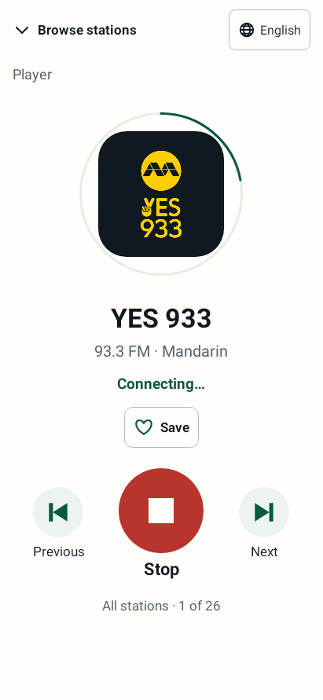
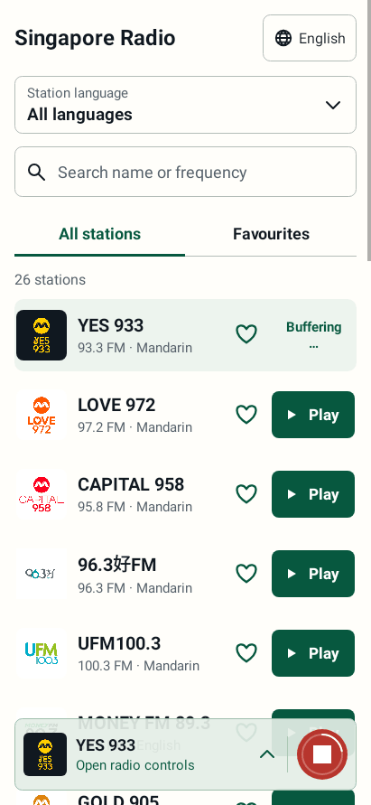

# Frontend redesign — version 1.4.2

This version implements the approved ivory/green mobile design, including the final smaller chevron and icon-only playback shortcut in the bottom bar.

## Screen behaviour

- **All stations** is the default launch tab. Station-language filtering and name/frequency search work together on both tabs.
- **Favourites** contains stations saved with the separate heart control. Saving or removing a station never sends a playback command.
- **Play in a station row** starts that station and opens the full Focus Player. A connecting or buffering station is not marked LIVE.
- **Browse stations / Android Back from the player** returns to the same browser, without stopping audio.
- **Player transition (1.4.2):** opening rises 32dp and fades in over 280 ms; closing reverses it over 224 ms. The browser and bottom bar stay still underneath, retaining their scroll position. The easing matches the approved gentle-rise design, with no bounce or zoom. Both station-row Play and the bottom bar use this navigation transition.
- **Bottom bar:** the logo, name, text and small chevron open the Focus Player. The separate circular control stops playback (red square) or starts the shown station (green triangle), without opening the player. The bar remains after stopping; it is hidden until a station has been selected.
- **Previous / Next:** cycle through a snapshot of the visible station list taken when a row starts playback. Changing a browser filter or saving a favourite does not unexpectedly change that sequence. Navigation wraps at its ends and is disabled for a one-station sequence.
- **Interrupted playback:** connecting and buffering retain a Stop action; paused, stopped or failed playback exposes Play. Starting a live stream reconnects to the current broadcast.
- **Loading feedback (1.4.1):** a forest-green ring around the Focus Player artwork and a thin white ring inside the bottom Stop button rotate once every 2.2 seconds while connecting or buffering. The artwork, text, button and Stop symbol stay still. Both rings disappear on playing, stopped, paused or failed playback. The artwork container and shortcut retain their existing dimensions in every state.

The following animations are rendered from the compiled Android views using simulated loading states:




The approved [transition design](animations/focus-player-transition-design.html) is preserved as an HTML fragment. This animation shows the compiled native Android implementation:


## Languages and accessibility

The default app language is English. The globe button lists English, 中文, Bahasa Melayu and தமிழ் using native names. The choice is saved locally and is independent of a station's broadcast language. Android App Bundles retain all four languages so switching does not depend on downloading another language pack.

Visible interface labels and station descriptions use the selected language; official station names retain their branding. The existing playback service and its notification text are unchanged.

Play, Stop, Previous, Next and favourite actions have accessible names. Icon-only shortcut labels include the selected station. Hearts expose their saved state. Controls retain generous touch targets while the small chevron is decorative inside the larger open-player action.

Loading rings are decorative and do not intercept touch or add screen-reader focus stops. The existing localized status announces connection changes. Android's disabled-animation setting keeps the ring stationary. Animation stops when its player is hidden or the activity is paused, and observers are removed when views detach.

The player transition also respects Android's disabled-animation setting, including changes during a transition. The inactive screen is excluded from keyboard and accessibility navigation. A temporary touch shield prevents taps from reaching controls through the moving surface. Android Back can reverse the transition from its current position. Pausing the activity settles the requested destination immediately; recreation restores that destination without replaying the entrance. Only the destination screen's loading ring animates while both screens are briefly visible.

Station names wrap, and rows stack on narrow screens, at large text sizes and for Tamil. Headers and player content scroll when needed. System bars, display cutouts and the keyboard have reserved space. Bottom padding lets the final station scroll clear of the translucent bar. The bar uses a translucent sage fill; it does not require a device-specific blur effect.

## Backend boundary

These files are unchanged from the branch's original base:

- `RadioService.java`
- `Station.java`
- `StationData.java`
- `AndroidManifest.xml`

The frontend still sends the same PLAY/STOP service actions and the same station names and URLs. Status messages are mapped into localized presentation without editing the service. The version increment and language-bundle setting are packaging changes; dependency versions are unchanged.

## Verification

```sh
./gradlew :app:testDebugUnitTest :app:lintDebug :app:assembleDebug
```

Use JDK 21 for the Android 16 Robolectric tests. The suite checks service intents for all 26 stations, persistence, search/filtering, both tabs, player navigation, shortcut behaviour, loading/error states and localization on API 24 and API 36. Native renders cover the English flow, all four app languages, 360dp with 1.6× text, and landscape.

Native view renders are in `app/build/reports/ui-redesign/`, including loading-state images, `motion-*` loading frames and `transition-*` navigation frames. Animation tests cover Stop hit testing during connecting/buffering, reduced motion, visibility and activity lifecycle on API 24 and API 36. Transition tests also cover interrupted navigation, scroll preservation, touch interception and recreation. These tests simulate service status messages; playback on a physical phone remains a manual check.

## Phone testing

Install the debug APK from `app/build/outputs/apk/debug/app-debug.apk`. An update requires the same application ID and signing certificate as the installed copy.

Suggested checks:

1. Start a station, return to browsing, then stop and restart using the bottom shortcut.
2. Save stations, switch to Favourites, and test Previous / Next from the player.
3. Search a station name and a frequency, and combine search with a station-language filter.
4. Switch app languages, rotate the phone, and try a larger system text size.
5. Confirm playback continues with the screen off and that disconnected networks show a recoverable message.
6. While connecting or buffering, confirm the full player ring rotates; return to browsing and confirm the shortcut ring rotates. Stop must cancel immediately, and the ring must disappear when audio plays.
7. Enable Android's Remove animations setting and confirm loading remains visible as a stationary ring.
8. Tap the bottom bar to open the player, then Browse stations or Android Back to return. Confirm the gentle motion does not interrupt sound or move the station list.
9. Press Android Back midway through opening, rotate or background the app during a transition, and confirm the destination remains fully visible and usable.

The app is version 1.4.2 / code 7, package `com.oai.singaporeradio`, minimum Android 7.0.
